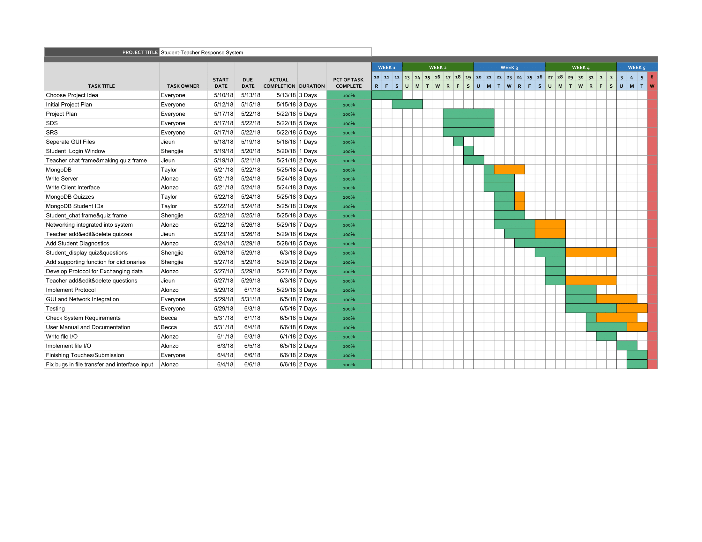
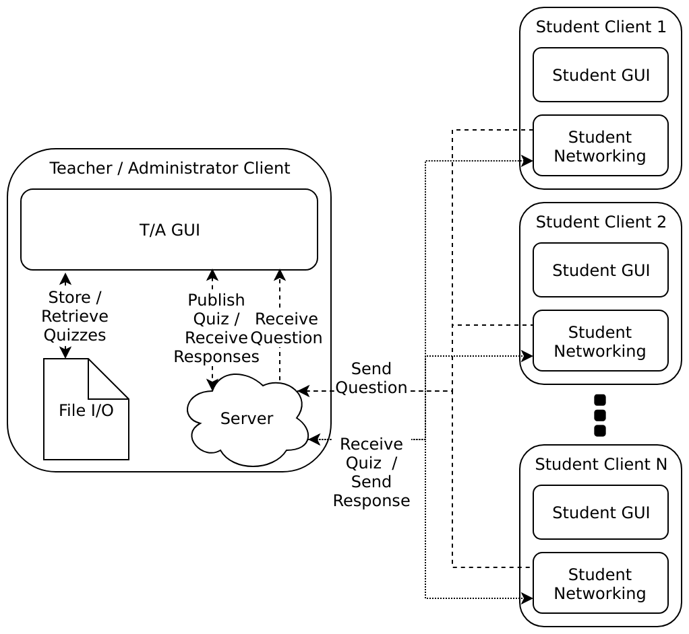
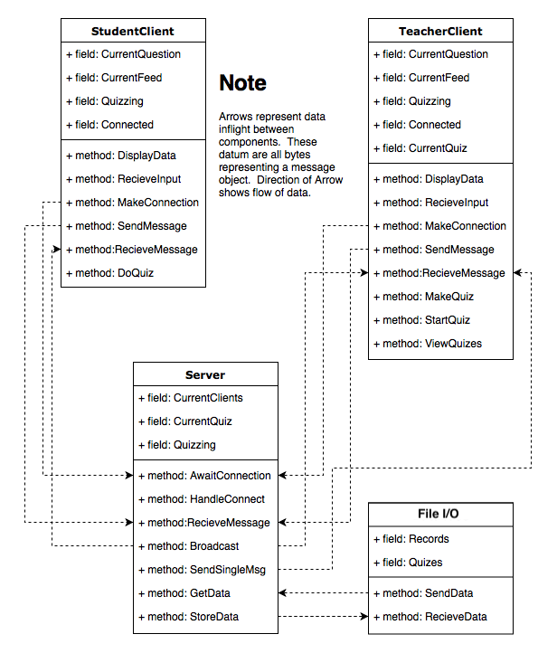

# Student-Teacher Response System
**Group 3**
## Project Plan
1. Purpose and Audience
   1. The intended audience: 
      1. This document is intended for developers and stakeholders of the Student-Teacher Response System 
   1. Purpose:
      1. To review team roles and responsibilities for a team member
      1. To provide risk and mitigation 
      1. To document development process and techniques that will be implemented
      1. To list project schedule and milestones for team member verification

1. Project Background

   We are creating a student/teacher response system allowing direct communication between a student and a teacher. A teacher can ask multiple choice questions with answer possibilites in the teacher application that students can answer in the students application. Also, students can ask a question and have the text sent to the teacher directly.

   Our project uses the python tkinter library for both the student and teacher user interface. To make sure students app can connect with the teachers application, we catch a TCP/IP address by a using web server. The quizzes can be created ahead of time and saved on the teacher's computer. During a lecture, the teacher may load any previously created quizzes to be sent to the students.
1. Team Roles and Responsibilities  

   Role | Team Member | Responsibilities
   ---|---|---
   System Architect| Everyone | Specify designs that maintain accordance with system requirements with which modules will be implemented. Communicate with implementers in order to exact and refine designs.
   Requirements Analyst| Everyone | Explore and specify objectively verifiable requirements of system and software. Communicate with system architects in order to exact and refine requirements.
   Quality Control| Becca | Develop testing plans(procedures) and perform integration tests.
   Developer(Back End)| Taylor, Alonzo | Realize(implement) designs of logical modules in accordance with specified requirements. Produce documentation for assisting developers and maintainers to utilize and modify the code.
   Developer(Front End)| Shengjie, Jieun | Realize(implement) designs of user interface modules in accordance with specified requirements. Produce documentation for assisting developers and maintainers to utilize and modify the code. 
   Technical Writer| Becca | Produce user documentation. Produce user manual. Maintain logs of group events.
   Configuration Control| Alonzo | Manage builds and modifications to the system. Facilitate usage of version control for all group members.
   Project Management| Becca, Shengjie | Develop a Project Plan. Maintain progress of system development within project schedule. Facilitate communication within group.
   Tester| Alonzo, Shengjie, Jieun, Taylor | Develop and perform unit tests on modules of the system.

1. Risks and Mitigation  

   Risk|Solution
   ---|---
   Tkinter becomes unusable for our project(a critical bug is discovered, Tkinter is deleted and support is discontinued, etc).|We will pursue usage of another GUI library to rely on from the pool of comparable technologies available(pyQT, FLTK, etc).
   We get behind schedule and the project is due soon.|We will cut out any advanced functionality causing delays and focus on only the core function.  We will increase the hours that each of us devote to the project and if need be meet on additional occasions.
   Someone gets sick or dies.| We will document our work and decisions not only to assist in future maintenance but also to account for this possibility.  By having multiple system architects, managers, and developers with knowledge of the same topics we will develop redundancy for this proposed event.   
   The current network configurations does not allow for a host (the professor).| We will create the ability to host the server remotely. 
   There is a lack of communication within the group about milestones reached and further steps in the development of the software.| We will use Github with mulitple branches to upload code and Slack for communication between members. A Gantt chart will be used to communicate responsibilities and timelines.  

1. Process  

   The development process will use an iterative approach, meaning we will go through the important steps in the software lifecycle in iterations. These main steps include requirements analysis, design, testing, and evaluation. Since we do not have active customers to work with, our process is not agile but a series of waterfalls. During each group meeting, we will start by going over the requirements making sure these are met and making some changes small changes along the way. For the main design, the workload is broken up by modules with the respective team members delegated for each module development. The back-end components (database and network) and the front-end components (student/teacher interface) will be developed seperately and merged in the end to complete the software. Knowledge of the functionality of both components will need to be known by at least one member from each component, since merging must be implemented. Testing of the software will occur simulatenously with the design, since the coders will be testing while creating the base product. Quality control is kept up throughout the project to mitigate risks, ensure requirements are met, and allow for added features if time allows. Meetings will be held two times a week for quality control purposes and to keep the milestone timeline on pace. Any project risks will be discussed during project meetings to avoid risk accumulation. 
   
1. Mechanisms, Methods, Techniques

   The software will use the Tkinter library of Python3 to develop the graphical user interface. The quizzes will be stored on individual text files generated by the application. The network will be written in Python3 with a web server that can make a connection between the student and teacher applications. The web server will ensure that student can directly send information to the teacher by asking a direction question or answering a quiz question sent via the teacher application. The TCP/IP protocol enables the student and teacher applications to connect with the server.
   
1. Detailed Schedule and Milestones

   Milestone | Task Description | Task Owner | Start Date | Due Date | Actual Completion Date | Signed off by
   ---|---|---|---|---|---|---
   1 | Choose Project/Explore Technologies, specifically database, programming language, network protocol | Everyone | Thursday 05/10/18 | Sunday 05/13/18 | Sunday 05/13/18 | Becca   
   2 | Write Project Plan, SRS, SDS Complete | Everyone | Tuesday 05/15/18 | Tuesday 05/22/18 | Tuesday 05/22/18 | Becca
   3 | Create files in Python to store data in MongoDB | Taylor | Friday 05/15/18 | Thursday 05/24/18 | Thursday 05/24/18 | Alonzo
   4 | Create files for Network in Python | Alonzo | Thursday 05/10/18 | Saturday 05/26/18 | Tuesday 05/29/18 | Shengjie
   5 | Create both student/teacher GUI view | Jieun/Shengjie | Saturday 05/19/18 | Tuesday 05/29/18 | Tuesday 05/28/18 | Becca
   6 | Integrate GUI and Network together to allow student and teacher to interact | Everyone | Monday 05/28/18 | Thursday 05/31/18 | Tuesday 06/05/18 | Shengjie
   7 | Go through quality assurance plan and requirements to make sure use cases and requirements are met | Everyone | Friday 05/25/18 | Friday 06/01/18 | Tuesday 06/05/18 | Alonzo
   8 | Go through SRS to make sure requirements are met and update SRS as needed | Becca | Tuesday 06/06/18 | Sunday 06/03/18 | Tuesday 06/05/18 | Becca 
   10 | Write User documentation and User Manual | Becca | Tuesday 06/05/18 | Monday 06/04/18 | Tuesday 06/05/18 | Taylor
   11 | Application Easily Accessible and Submission | Everyone | Wednesday 06/06/18 | Wednesday 06/06/18 | Wednesday 06/06/18 | Everyone
   
   

## Meeting Notes
Task/Deliverable | Asignee | Start Date | End Date | Estimated Time
---|---|---|---|---
Choose project idea | Alonzo | May 10th | May 13th | 4 hours
Choose programming language | Alonzo | May 10th | May 10th | 20 minutes
Choose GUI library | Shengjie, Jieun | May 10th | May 10th | 4 hours
Write initial project plan | Everyone | May 12th | May 14th | 3 hours
Write project plan, SDS, SRS | Everyone | May 17th and May 21st | May 21st | 2 days
Discussing data format for GUI integration | Alonzo, Jieun, Shengjie | May 28th | May 28th | 2 hours
Check System Requirements | Everyone | May 31st | May 31st | 2 hours
Merging Network and GUI | Alonzo, Jieun, Shengjie | June 3rd | June 3rd | 6 hours
Continue Merging Network and GUI, Writing documents | Everyone | June 5th | June 5th | 10 hours
Project Completion. | Everyone | June 6th | June 6th | 6 hours

## Software Requirements
1. Introduction
   1. Intended Audience and Purpose  
      - Users - This document describes the functionality of our product, including use cases and external behavior. A user looking to understand the capabilities of our product should consult this document.  
      - Marketing - This document will serve as a reference for any marketing materials produced for the product. The product's description from the perspective of a potential user is given in the Concept of Operations section, which can be referenced when producing advertising materials.
      - Product Management - A high-level, non-technical overview of the functionality of the product is necessary for managing the distribution of personnel and resources, as well as for gauging progress towards project completion. The features described in this section can be used as a starting point for laying out project milestones.
   1. How to Use the Document
      - Section 2 contains the Concept of Operations. It describes the context in which the software will be run, as well as the third party tools, libraries, and APIs used by the software. Use Cases are listed, detailing common scenarios the user will encounter when using the product and the desired product behavior in each scenario.
      - Section 3 contains the Behavioral Requirements. The inputs and their restrictions are listed, as well as outputs. The externally visible outputs as a function of inputs are described.
1. Concept of Operations  
   The purpose of the software is to provide a tool for professors and students to ask questions and receive instant feedback. We expect the application to be run in a large-scale classroom where both the professors and students will launch the application on a personal computer/laptop. Professors will be able to ask multiple-choice questions and receive any comments or questions a student sends direclty. Students will be given the opportunity to ask questions about assignments and course material with a chat feature to send to the professor during the class. The student may also receive quiz questions and submit their multiple-choice answer. It enables students to learn from questions others have and helps the teacher glean how the class responds to their lecture material. Although the chat feature may be a distraction during class for the teacher, we imagine the teacher spending time at the end of class scrolling through comments/questions or having an assistant manage messages during the classroom time. Also, a teacher may create quizzes prior to class and pull up saved quizzes to share with students to avoid wasting time making multiple questions during class as well. 
   
   1. System Context  
      1. tkinter will be used to as the GUI.  
      1. The program is compatible with a version of Python 3.6.5 or newer.     
      
   1. System Capabilities  
   
      Use Case #1: Initialization     
      
      1. Description: The students wish to connect to the professor's client to begin using the software.
      1. Actors: 
         1. One professor
         1. At least one student
      1. Preconditions:
         1. The professor must have the host application installed.
         1. All students must have the client application installed.
         1. All actors must be connected to the same local network.
      1. Flow of Events:
         1. Basic Flow
            1. The professor starts up the host application.
            1. The necessary connection information is displayed on the professor's screen.
            1. The professor shares this information with the students.
            1. The students start up the client applications.
            1. The client application prompts the student for their student ID number.
            1. The student inputs their ID number.
            1. The client application prompts the student for connection information.
            1. The student inputs the connection information given to them by the professor.
            1. Connection status is displayed on the student's screen.
            1. The number of connected students is displayed on the professor's screen.
            1. The students and the professor will be brought to their respective main pages   
      1. Exceptions:
           1. Unable to connect:  
                  If after step 'h' the client is unable to connect to the professor, the student will be alerted about the connection failure, and will be given a list of potential remedies (Restart the application, verify correct spelling, ensure connectivity to the correct network, etc.) The use case will resume on step 'g'.
                  
      Use Case #2: Professor creates a quiz
         1. Description: The professor wishes to send multiple-choice question/questions to the students and receive back responses.
         1. Actors:
            1. One professor
            1. At least one student   
         1. Preconditions:
            1. The actors must have gone through the Initialization use case with no errors.
         1. Flow of Events:
            1. Basic Flow
               1. The professor starts out on the main page.
               1. The professor selects the option to create question.
               1. The professor inputs the multiple choice answers as well as selecting correct answer.
               1. The professor will submit the question and may create more questions if wanted by repeating steps 'b' and 'c'.
               1. The professor will indicate they are finished editing the quiz.
               1. The quiz will be saved, and the professor will be returned to the main page.
            1. Alternative Flows:
               1. The professor wishes to cancel the quiz creation process:  
                  Exiting the quiz creation section without publishing or saving will delete the current quiz. This returns the use case to step 'a'.       
           1. Exceptions:
               1. A question is not inputted into the application:  
                  The professor will not be given the ability to save a quiz without first inputting a question. The use case resumes at step 'c'.
                  
      Use Case #3: Students receive a quiz
         1. Description: The professor has published a quiz, and a student wishes to submit a response.
         1. Actors:
            1. Student
         1. Preconditions:
            1. The student must have the application running and be successfully connected to the professor.
            1. A quiz must be posted by the professor
         1. Flow of Events:
            1. Basic Flow
               1. The student starts out on the main page
               1. The student will be see the quiz name in view.
               1. The student selects the quiz they wish to respond to.
               1. The question and possible answers are displayed to the student.
               1. The student selects the answer of their choice.
               1. The student may change their selection by repeating step 'e'.
               1. Once the student has decided on a final answer, they are given the option to confirm their choice.
               1. The student will be returned to the main page.
            1. Alternative Flows
               1. The student wishes to exit the quiz without confirming an answer:  
                  The student may exit the quiz at any time, and be returned to step 'c'. Their selected but unconfirmed answer will not be sent to the professor.
            1. Exceptions
               1. An answer is not selected:  
                  The student will be unable to confirm an answer without first selecting one. This will leave them at step 'f'.
                  
      Use Case #4: The professor wishes to edit an existing quiz
         1. Description: The professor wishes to edit an existing quiz.
         1. Actors:
            1. Professor
         1. Preconditions:
            1. The professor must have a quiz saved.
         1. Flow of Events:
            1. Basic Flow
               1. The professor starts on the main page.
               1. All saved quizzes are displayed.
               1. The professor selects the quiz they wish to edit.
               1. Information about the quiz is displayed.
               1. The professor is given the ability to modify the quiz name and description.
               1. The professor selects one of the quiz's questions.
               1. The professor is given the ability to modify the question's answers.
               1. The professor selects the option to save their changes.
               1. The professor will be returned to the main page.
            1. Alternative Flows
               None
                  
      Use Case #5: A student wishes to send a message to the professor.   
         1. Description: Students may wish to write down a question to be addressed by the professor at a later time, without disrupting the class.
         1. Actors:
            1. A student
            1. A professor
         1. Preconditions:
            1. The professor must have the host application running.
            1. The student must have the client application running.
            1. The student must be on the same network as the professor.
            1. The student must have successfully connected to the professor.
         1. Flow of Events:
            1. Basic Flow:
               1. The student starts on the main page.
               1. The student inputs their message for the professor into designated message area.
               1. The student submits their message.
               1. The message appears on the teacher view.
            1. Exceptions:
               1. The question box is left blank:  
                  The student will not be able to submit without entering a message.
                     
1. Behavioral Requirements
   1. System Inputs and Outputs
      1. Inputs  
         1. Student  
            ID: A string between 1 and 3000 characters in length used to uniquely identify each student.  
            IP Address: The professor's local IP, used by the students to connect to the T/A client.  
            Question: A string between 1 and 3000 characters in length that can be sent from a student to the professor.  
            Quiz Selection: Each available quiz can be selected to give the student's responses.  
            Quiz Answer: A series of radio buttons indicating the student's selection in a quiz question.  
         1. Teacher
            Select Quiz: Each saved quiz can be selected, indicating it is to be acted on by the "edit", "delete", or "send" functions.  
            New Quiz: Strings between 1 and 3000 characters in length for the name and description of the quiz. Each question takes strings between 1 and 3000 characters in length for the question and for each of the 5 responses. Each question has 5 radio buttons to select the correct answer.  
            Edit Quiz: A button to bring up the editing interface for the selected quiz.  
            Delete Quiz: A button to delete the selected quiz.  
            Send Quiz: A button to send the selected quiz to the students.  
      1. Outputs
         1. Student
            Available Quizzes: A list of all sent quizzes that the student may participate in.  
            Questions: Once a quiz is selected, a list of questions is displayed.  
            Answers: Once a question is selected, a list of answer choices is displayed.  
         1. Teacher
            Questions: Questions sent by the students are displayed on the teacher's main page.  
            Quizzes: A list of saved quizzes is displayed on the teacher's main page.  
            
            
            
1. Quality Requirements
   
   Security
   - Users need to access application by input student ID in login interface
   - Students send message to teacher through server 

   Reliability
   - Student version application can serve multiple users
   - Socket update question that teacher assigned should be in real time
   - Socket update message that student send to teacher should be in real time

   Accessibility
   - Users are easy to use the application and each part of functionality is clear for users to locate
   
1. Expected Subsets  
   Our system will be composed of two sections: A student client and a teacher client. The student client is composed of two primary modules: a networking module, and an interface module. The teacher client is composed of three primary modules: a server module, an interface module, and a file I/O module. The student's networking module handles sending and receiving data from the teacher's server module. Both interface modules handle user interaction. The teacher's file I/O module handles saving and loading quizzes to the filesystem.  
   The security requirement applies to our networking modules, but not the interface module. As long as the network connection between the student and professor is secure, the student's interface does not need to fulfill a security requirement. Due to the storage of quizzes in local text files on the professor's computer, the securing of the file I/O module relies on the security of the professor's computer. Anyone with access to the professor's personal files will have access to the saved quizzes.  
   The reliability requirement must be met with the network module and the interface module. The application must serve multiple users through the network. The reliability of the application is limited by the reliability of the local network. Therefore, a high-quality network connection is recommended for both the professor and the students.  
   
1. Fundamental Assumptions  
   The software is developed using Python 3.6.5; therefore the user must have this version of Python or newer. Furthermore, the user must have an accessible network signal through the entire use of the application. If the network signal is lost, the user will not have access to the full functionality of the software. The students and teachers will be on the same network for interactions. If the students are not on the same network, there will not be any communications between teacher and student. 

1. Apendices
   1. Definitions and Acronyms
      1. Definitions
      1. Acronyms and Abbreviations
         1. GUI: graphical user interface 
         1. SRS: software requirements specification
         1. SDS: software design specification
         1. TCP/IP: transmisson control protocol/internet protocol
         
   1. References
      1. https://docs.python.org/3/library/tk.html
      1. https://www.python.org/downloads/
      
## Software Design
### Software Architecture

Our system will have two separate user interfaces:  one for the student client, and one for the the T/A (teacher/administrator) client.  This is done to clearly divide the functionality of both and provide greater cohesion between modules associated with a student and modules associated with the professor.  The system will provide distinct functionality depending on whether a user is a student or a teacher. A teacher does not need to connect to another teacher and a student does not need to connect to another student, so the behavior of each should be independent of each other.  

A server module is incorporated into the T/A client.  The teacher is essential for hosting a class discussion warranting feedback.  Without the teacher, there is no reason for students to use the system, thus the T/A client and the server have a functional cohesion, to serve the student. Each student client will have a networking module which handles connection and communiaction with the T/A server.  We have chosen to develop the server as a separate module to allow for future maintenance.  Should we decide to separate the server from the T/A client, it will be easier due to the module's limited coupling by design.  

A database will be incorporated into the T/A client in order to store premade quizes and a whitelist of student IDs.  Quizzes made by the professor in the T/A client can be sent to the database module to be saved, allowing for later retrieval.  The professor will also be able to create a student ID whitelist, which will prevent unauthorized students from participating in the class. This whitelist will be stored in the database.

  

### Detailed Design

To acheive manifestation of our system, we will have three main components.  Client Applications, a Server, and a File I/O.
The Clients and Server will communicate with each other using Internet Protocols. The professor client writes to the file system through File I/O.
   ##### GUI:
   The user interface will display the student or professor data.  The user interface will provide methods for sending messages, sending answer responses for the student and for creating quizzes, sending quizzes, and recieving messages for the teacher. Both the student and professor interface are components of their own respective clients. 
   ##### Network Interface:
   The network will handle all of the logical functionality of our client along with the network communication.  The network will have a method for initializing connection with the server which at that point will allow it to spawn threads of processing to communicate with the Server.  These threads will carry methods for recieving communications, for sending communications, and for displaying communications. Here, other methods will be provided for parsing communications and for forming messages for our protocol.  The user interface will have data for the current state of the program, such as current quizzes, current quiz questions, current chat feed, and how many students are present.

#### Server
The Server will possess an up to date log of current connection addresses.  The server will have a method to await connections that is always running during operation.  This method will spawn threads of processing that have different methods to handle a new connection, to send messages to individuals, to send messages to all clients, to recieve messages from individuals, and to perfom quizes.  The server will have methods for communicating with the database in order to store and retrieve quizes as well as statistics related to those quizes.  

#### File I/O
The File I/O will hold premade quizes as well as class performance on said quizes.  The file system will have methods for storing and retrieving this data for the network to pass along to the user interface.

  

### Quality Assurance Plan
1. Reviews
   1. The manager of the team will review project plan, identify if it is realistic, and evaluate readability.
   1. Each member of the team will review SDS and SRS whether the design capture all the requirements and identify areas that need to be improved
   1. Each member of the team will review source code for the project to identify if all SRS documents are implemented
   1. Each programmer will perform unit test for each modules during developing as well as GUI for errors
   1. Technical Writer will review software documentation(User Manual) and evaluate if it is easy to understand for users

1. Testing

To ensure our software meets SRS, testing will be done in the following list:

1. Test Process
   1. Login/Logout
   1. Posting/Receiving questions
   1. Publishing quiz
   1. Submitting quiz
   1. Storing quiz
  
1. Outline of Test Cases
   1. Login/Logout
      1. Verify user can log in
         1. Steps:
            1. Enter name and identification to log in
         1. Expected Result:
            1. User can start out on main chat page
      1. Verify user can log out
         1. Steps:
            1. Click log out button
         1. Expected Result:
            1. User is exited from the application
      1. Verify user cannot start out on chat page without login information being typed
         1. Steps:
            1. Click login button without identification or IP address
         1. Expected Result:
            1. User is not able to access application  
         
   1. Sending messages to teacher
      1. Verify user(students) can send messages to teacher
         1. Steps:
            1. Log in with user name and identification
            1. Type question into input box
            1. Click send button
         1. Expected Result:
            1. Professor receives the question
      1. Verify user(teacher) can receive questions
         1. Steps:
            1. Log in with name
         1. Expected Result:
            1. User can see list of the messages that are sent by users(Students)
            
   1. Publishing quiz
      1. Verify user(Teacher) can publish a quiz
         1. Steps:
            1. Log in with name
            1. Create quiz questions
            1. Create multiple choice quiz
            1. Click "Send" 
         1. Expected Result:
            1. User(Student) receives the quiz  
            
   1. Submitting quiz
      1. Verify user(Students) can open and submit a quiz
         1. Steps:
            1. Log in with user name and IP Address
            1. Click one quiz among list of quizzes
            1. Answer the quiz
            1. Click "Submit" button
         1. Expected Result:
            1. The quiz is erased off of the student view
            
   1. Storing quiz
      1. Verify all created quizzes are stored in the file system
         1. Steps:
            1. Log in with name
            1. User(Teacher) creates a quiz
            1. User logs out and logs back in
         1. Expected Result:
            1. User(Teacher&Students) can see all the list of premade quizzes 
